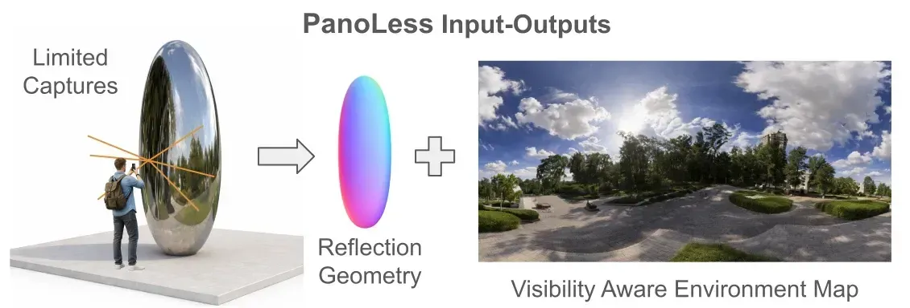
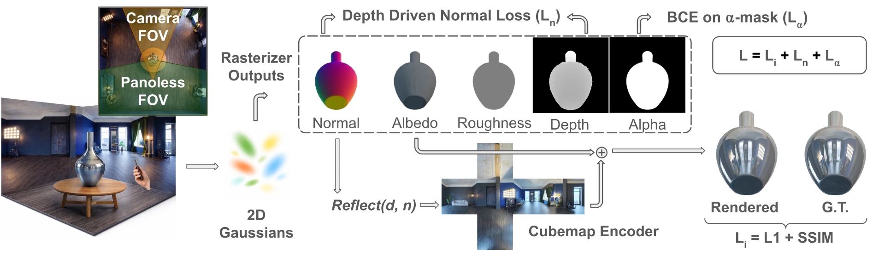

# PanoLess: Environment Reconstruction from Partial Reflective Views

**[Paper (ECCV 2026)](https://arxiv.org/abs/2607.25362)** | Rice University

> Ahitagni Das, Ashok Veeraraghavan, Vivek Boominathan

<p align="center"></p>

PanoLess reconstructs the surrounding environment from images captured on only one side of a reflective surface — no panoramic capture required. It combines surface-aligned 2D Gaussian splats with a jointly optimized neural cubemap and an explicit visibility map that distinguishes well-observed environment directions from unsupported ones.

## Method

<p align="center"></p>

## Ablations

Reproduce the ablation study from Table 2 (Vase scene):

```bash
bash scripts/run_ablations.sh -s <scene_path> [-o <output_base>]
```

Results are written to `output/ablations/<scene_name>/` unless `-o` is given.

Individual flags:

| Flag | Ablation |
|---|---|
| `--rho_weighted_env` | Scale cubemap by (1−ρ)² instead of using it directly |
| `--no_alpha_loss` | Remove early silhouette supervision Lα |
| `--no_normal_loss` | Remove normal consistency loss Ln |

## Setup

```bash
git clone --recursive https://github.com/vb-glee/panoless
cd panoless
conda create -n panoless python=3.10
conda activate panoless
bash scripts/install.sh
```

`scripts/install.sh` installs a CUDA 12.4 PyTorch build, installs all Python dependencies, and builds the CUDA submodules (`diff-surfel-rasterization`, `simple-knn`, `cubemapencoder`). It expects `CUDA_HOME=/usr/local/cuda` and GCC 12; edit the exports at the top of the script for other toolchains.

If you already cloned without `--recursive`, run `git submodule update --init --recursive`.

## Dataset

We evaluate on:

- **Shiny Partial** (ours) — Blender renders from a single hemisphere with ground-truth environment maps; three scenes: Cola, Vase, Mirror (100 train / 200 test images each). [Download](https://drive.google.com/drive/folders/1YBVAv5UO2moO691udmFafXf7titgpcy4?usp=sharing).
- **Partial Shiny Blender** — single-hemisphere subset of [Ref-NeRF's Shiny Blender](https://storage.googleapis.com/gresearch/refraw360/ref.zip).
- **Shiny Real** — handheld video captures processed with COLMAP.

## Training

```bash
python train.py -s <scene_path> --model_path <output_path> --eval
```

Key flags:

| Flag | Default | Description |
|---|---|---|
| `--iterations` | 45000 | Total training iterations |
| `--env_start_iter` | 0 | Iteration to activate the environment map (0 = from the first iteration) |
| `--pose_jitter_deg` | 0.0 | Std dev (degrees) of rotation noise applied to train cameras |
| `--pose_jitter_seed` | 42 | RNG seed for pose jitter |

## Environment Map Evaluation

```bash
python scripts/eval_envmaps.py --full      # compare methods on Shiny Partial
python scripts/eval_envmaps.py --ablation  # ablation variants vs. ground truth
python scripts/eval_envmaps.py             # both of the above
```

Ground-truth environment PNGs are read from `envs/` (`<scene>.png` for `vase`, `cola`, `mirror`). This directory is not tracked in git, so place the maps there yourself. Method outputs are read from `local/data/<method>/` and ablation outputs from `local/ablation/`; both are gitignored. Results are written to `local/comparison.json` and `local/ablations.json`.

## Citation

```bibtex
@inproceedings{das2026panoless,
  title     = {PanoLess: Environment Reconstruction from Partial Reflective Views},
  author    = {Das, Ahitagni and Veeraraghavan, Ashok and Boominathan, Vivek},
  booktitle = {ECCV},
  year      = {2026}
}
```

## Acknowledgments

PanoLess builds on:

- [2D Gaussian Splatting](https://surfsplatting.github.io/) — surface-aligned primitives and normal extraction
- [3DGS-DR](https://github.com/gapszju/3DGS-DR) — deferred reflection rendering and cubemap encoder
- [Ref-GS (CVPR 2025)](https://arxiv.org/abs/2412.00905) — 2DGS with deferred shading for specular surfaces
- [diff-surfel-rasterization](https://github.com/hbb1/diff-surfel-rasterization) — 2DGS CUDA rasterizer

## Contact

Ahitagni Das — [adas@rice.edu](mailto:adas@rice.edu)
